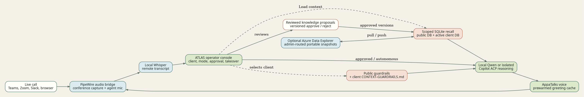

# ATLAS Technical Reference

This guide covers the local development and operations details for ATLAS | Live Agentic Support. Start with `README.md` for the product overview and operator workflow.

## Architecture



ATLAS coordinates the following local and optional remote services:

| Service | Responsibility |
| --- | --- |
| API | Fastify control plane and desktop dashboard on `127.0.0.1:4173`. |
| Desktop | Electron operator console. |
| Audio bridge | Creates and removes PipeWire virtual devices on Linux. |
| Transcription | FFmpeg segment capture plus local `whisper.cpp`. |
| Reasoning | Local Qwen or authenticated GitHub Copilot CLI through ACP. |
| Voice | Local AppaTalks/Chatterbox speech synthesis service. |
| Knowledge | Client-ID-scoped SQLite caches, optional Azure Data Explorer snapshots, and a durable shared public folder. |

Use the supervisor rather than starting those processes manually:

```bash
npm run app:start
npm run app:status
npm run app:stop
```

Logs default to `~/.local/state/voice-bridge/`. The supervisor owns its children and removes Linux virtual audio modules during shutdown.

## Installation

For a public release, use the bootstrap shown in [README.md](README.md). It clones ATLAS to `~/.local/share/atlas-agent`, runs the versioned installer, creates the `atlas` launcher, and creates a Linux desktop entry.

```bash
curl -fsSL https://raw.githubusercontent.com/appatalks/atlas-agent/main/get-atlas.sh | bash
atlas
```

For a checked-out repository, use the same installer directly:

```bash
bash tools/install.sh
atlas
```

For live Linux operation, provide Node.js 24 or newer, PipeWire/PulseAudio compatibility tools (`pactl`, `pw-cat`, and FFmpeg), a local `whisper.cpp` checkout and model, the authorized AppaTalks reference WAV, and either a local Qwen model service or an authenticated `copilot` CLI. ATLAS uses Node's built-in SQLite and FTS5 support for knowledge retrieval. Use `.env.example` as the configuration reference. Do not commit a populated `.env` file.

The installer supports `--skip-voice`, `--skip-whisper`, and `--no-launcher` for development or staged setup. `atlas status`, `atlas stop`, and `atlas update` manage an installed checkout.

### Repository And ATSLA Migration

ATLAS means **AppaTalks Live Agentic Support**. The bootstrap migrates prior `atlas-live-agentic-support` and `atsla-support-live-agent` checkouts to `atlas-agent`, installs `atlas` as the primary command, and retains `atsla` as a forwarding compatibility alias. Existing `ATSLA_*` environment variables, `.atsla` knowledge folders, `.atsla-cache` client caches, ATSLA theme/profile settings, `atsla-knowledge-snapshot` payloads, and `AtslaKnowledgeSnapshots` ADX tables remain readable. New writes use `ATLAS_*`, `.atlas`, `.atlas-cache`, `atlas-knowledge-snapshot`, and `AtlasKnowledgeSnapshots`.

Loading an existing ADX-backed client reads the canonical table first, falls back to the legacy table when needed, and writes the next snapshot to `AtlasKnowledgeSnapshots`. The legacy table is left intact for rollback safety.

## Audio Routing

On Linux, ATLAS creates two dedicated sinks:

| Name | Role |
| --- | --- |
| `voice_bridge_conference` | Communication-app speaker target. Its monitor is the remote-call capture source. |
| `voice_bridge_agent` | Agent-only speech target. Its monitor is the virtual agent microphone for the call. |

The conference and agent monitors are both looped to the physical operator output. The agent monitor is never mixed back into conference capture, preventing agent speech from being transcribed as remote audio. The physical operator microphone remains independent from the agent microphone.

Use the **Operator mic** / **Agent mic** control in the desktop application to choose which source the communication client receives. Run `Wire call` after joining or reconnecting a browser-based call.

```bash
npm run audio:dry-run
npm run audio:status
```

On macOS, configure a virtual output device such as BlackHole and set `VOICE_BRIDGE_MAC_AGENT_DEVICE`. Linux routing scripts are not used on macOS.

## Transcription

The segment runner captures `voice_bridge_conference.monitor` into four-second, 16 kHz mono WAV files. A volume gate skips silent input before local Whisper processing. Consecutive speech segments are combined and posted as one remote turn when the next below-threshold segment marks a pause, keeping the conversation timeline and model context aligned with natural utterances. Semantic non-speech events such as silence, throat clearing, or punctuation-only transcripts are documented without model generation or speech.

```bash
npm run whisper:bootstrap:dry-run
bash tools/bootstrap-whisper.sh

export WHISPER_BIN="$PWD/vendor/whisper.cpp/build/bin/whisper-cli"
export WHISPER_MODEL="$PWD/vendor/whisper.cpp/models/ggml-base.en.bin"
bash tools/transcribe-stream.sh --check
```

Set `VOICE_BRIDGE_SILENCE_DB` to adjust the volume gate. The bootstrap script attempts CUDA when available and falls back to CPU unless `WHISPER_CUDA=true` requires GPU support.

## Database Clients And Sessions

A database client has a stable client ID, display name, backend database route, and an optional supplementary context folder. When used, that folder includes:

```text
client-profile.json
context-drop/
knowledge/
skills/
learnings/
meetings/
```

`client-profile.json`, `context-drop/`, `knowledge/`, `skills/`, and `learnings/` are optional additive import sources. Selecting **Load context** first pulls the database client, then merges reviewed supplementary files into the client-ID-keyed local cache. The `meetings/` directory is never imported. Files or folders named `restricted`, and filenames containing `.restricted.`, are retained in the index but excluded from recall.

Each client has a physically separate SQLite cache keyed by stable client ID. In ADX mode that cache materializes only the client database selected in the main **Client** window, preserving identical FTS retrieval and low live-call latency. The shared public knowledge base remains a durable operator folder with its own local cache and synchronizes to ADX only when an operator selects a public database. ATLAS chooses database routes from operator state and stable client identity, not caller text, and sends the reasoning model only bounded retrieved excerpts. The model receives no SQL, KQL, database selector, client registry, or database tool.

Sessions are persisted under `~/.local/share/voice-bridge/sessions/` and include their stable client scope plus an `active`, `awaiting-feedback`, or `completed` lifecycle. The application lists, opens, and renames only sessions belonging to the selected client or the dedicated public-only scope. Starting a session always sends the Standard Greeting once. A clear customer resolution phrase such as "that fixed it" requests outcome feedback automatically. The next customer turn completes the session, or the operator can use **Ask feedback & finish** and **Finish without feedback**. Switching clients persists the prior session, clears live transcript/drafts/escalations, unloads client context, and starts with an empty session list when that scope has no prior sessions.

When an optional supplementary folder is configured, remote observations and generated summaries can be staged under its `learnings/` directory. They do not enter active recall until an operator reviews the files and explicitly reloads that client. Verbatim transcript and summary files are stored under `meetings/` only when their respective retention options are enabled. Database-only clients retain sessions and reviewed knowledge proposals without requiring filesystem artifacts.

Global documentation is separate from client data. Configure one durable shared public folder in **Settings** and keep its root distinct from every supplementary client folder.

### Supplementary Context And Guardrails

Supplementary client folders include `context-drop/`, an operator-friendly additive import area. ATLAS accepts reviewed `.md`, `.txt`, `.json`, `.csv`, `.yaml`, and `.yml` files, chunks them, indexes them with FTS5, and records stable source paths and content hashes. Unchanged files are not reindexed; removed imports are pruned without affecting future AI-approved database records.

Use `context-drop/CONTEXT-GUARDRAILS.md` for client-specific policy. Write clear sections for **May Discuss**, **Sensitive Or Restricted**, and **Required Behavior**. Describe what to decline, what to escalate, and the safe alternative to provide. This file is loaded before the client reference material.

For organization-wide policy, create `GLOBAL-GUARDRAILS.md` at the root of the durable shared public knowledge folder. Use [template-public-knowledgebase](template-public-knowledgebase) or [docs/GLOBAL-GUARDRAILS.template.md](docs/GLOBAL-GUARDRAILS.template.md) as a starting point. **Load context** refreshes this folder's local public cache and synchronizes it through ADX only when a public database is selected. Global guardrails are included for every session and take precedence over client guardrails. Reference files cannot override either level.

Best practices:

- Keep each file focused, short, and reviewed; use descriptive filenames and headings.
- Put public product facts and support procedures in normal reference files; put disclosure limits in guardrail files.
- Prefer data extracts that omit credentials, unnecessary personal data, and raw production exports.
- State an escalation path for authorization, pricing, legal, security, and account-specific requests.
- Review `learnings/` before promoting observations into durable client reference material.
- Start optional supplementary folders from [template-client-folder](template-client-folder) and public documentation from [template-public-knowledgebase](template-public-knowledgebase).
- Keep real client folders, local caches, and generated `.atlas/` databases outside the git repository.

### Reviewed Knowledge Updates

Imported files and operator policies are not writable by the conversation model. Manual AI-generated meeting summaries create pending proposals under `ai/session-summaries/` in the active client's database. On session completion, the model instead returns a structured evaluation with outcome, reusable candidates, confidence, risk, and exact transcript evidence. Application policy, not the model alone, decides promotion.

An autonomous candidate can publish only when the session is resolved, the candidate is low risk, at least one evidence quote exactly matches the transcript, the content passes deterministic sensitive-data and prompt-injection filters, and confidence is at least `0.96` without positive feedback or `0.90` with a score of four or five. A score of one or two blocks automatic promotion. Medium-risk or lower-confidence valid candidates remain pending; high-risk, unsafe, or ungrounded candidates are discarded before reaching ADX. Repetition never upgrades autonomous material to seed or operator authority.

Approved learned topics use stable `learned/<topic>.md` paths, so repeated successful sessions update one versioned procedure rather than creating one document per call. Retrieval combines lexical relevance with bounded authority, confidence, evidence count, positive/negative feedback, and validation recency. Seed and operator knowledge retain an authority advantage. Operators can disable autonomous promotion or feedback under **Settings > Agent**, review pending proposals, retire a learned topic, or replace the client database from a known-good seed.

Proposal scope is resolved from operator state. Client proposal operations require explicitly loaded client context and synchronize to that client's configured backend. Public proposals remain in the durable shared folder's local knowledge store and synchronize to ADX only when a public database is selected. Switching clients changes the proposal namespace immediately. Guardrail policies cannot be changed through the proposal API.

### Knowledge Backends And Routing

Choose **Local SQLite** or **Azure Data Explorer** under **Settings > Workspace**. SQLite is the default and requires no cloud service. ADX mode uses the official `azure-kusto-data` SDK and keeps a local materialized SQLite cache for live recall.

ADX accepts a direct cluster endpoint or an Azure Data Explorer portal link. Authentication options are cached device code, interactive browser, Azure CLI, managed identity, or application credentials. **Device code** is recommended for personal Microsoft accounts without subscriptions and matches EVA's Kusto authentication path. ATLAS first performs a direct MSAL silent refresh from the secure OS cache and prompts only when no reusable Kusto session exists. Azure CLI remains useful for work accounts with an active CLI account profile. Managed-identity and application IDs/secrets are environment-only; ATLAS never persists them in settings or exposes them to the model.

```bash
ATLAS_KNOWLEDGE_BACKEND=adx
ATLAS_ADX_CLUSTER_URL=https://cluster.region.kusto.windows.net
ATLAS_ADX_AUTH_MODE=device-code
```

`ATLAS_ADX_DEFAULT_DATABASE` is an optional shared-public route and is never used as a private-client fallback. Leave it blank to keep public knowledge local, or select an accessible database in Settings to synchronize the durable public folder's cache and snapshots. Every private client must resolve to its own explicitly selected or uniquely matched ADX database.

Database clients are stored in the administrator client catalog with a stable `id`. A supplementary `client-profile.json` mirrors that identity when a folder is attached. An optional `knowledgeDatabase` provides an explicit route. Resolution fails closed and uses this order:

1. Explicit database selected for the client in the main **Client** window.
2. One exact accessible database-name match against the stable ID or client name.
3. Exactly one accessible database already containing that scope ID.

Missing and ambiguous routes are errors. Caller text and model output never participate in routing. The main **Client** selector automatically lists databases available to the authenticated admin and offers a manual refresh. Workspace settings contain backend, authentication, cluster, and default public-database configuration, but no private-client selector.

On first device-code use, open the displayed Microsoft device-login page and enter the code. The Kusto session is then stored under the dedicated `atlas-adx` identity cache. Set `ATLAS_ADX_ALLOW_UNENCRYPTED_TOKEN_CACHE=true` only on a trusted single-user machine when no OS credential store is available.

Use a separate ADX database and scoped RBAC identity per private client. When configured, the optional default database carries only shared public knowledge. Do not use one unrestricted identity across unrelated customer databases.

On **Load context**, ATLAS pulls the latest matching ADX snapshot when present, refreshes reviewed file imports locally, and appends the merged versioned snapshot back to the same resolved database. Approved and autonomously promoted proposals also synchronize after mutation. Explicit **Pull** and **Push** controls are available for recovery and administration.

Portable JSON snapshots include documents, quality metadata, immutable versions, policies, proposal state, and compaction metadata. Client snapshots move between SQLite and ADX; public snapshots back up or restore the local shared store. To bound long-running ADX transfers, each snapshot carries the latest 20 versions per document and latest 1,000 proposals while the local SQLite audit database keeps full history. The snapshot scope ID must match the selected client or public scope, so cross-client imports are rejected.

### Azure Data Explorer Authentication

For a personal Microsoft account without an Azure subscription, select **Device code (personal account)**. ATLAS uses the Kusto scope directly, matching Eva-Agent's approach and avoiding Azure Resource Manager subscription requirements.

1. Configure the ADX cluster endpoint or paste its Data Explorer portal URL.
2. Select `device-code` authentication and choose **Discover** or **Load context**.
3. On the first use, open `https://login.microsoft.com/device` and enter the displayed code.
4. Complete sign-in with an account authorized on the ADX databases.
5. ATLAS stores the MSAL session in the OS credential store and uses silent refresh for later commands and restarts.

```bash
ATLAS_KNOWLEDGE_BACKEND=adx
ATLAS_ADX_CLUSTER_URL=https://cluster.region.kusto.windows.net
ATLAS_ADX_AUTH_MODE=device-code
```

`ATLAS_ADX_ALLOW_UNENCRYPTED_TOKEN_CACHE` defaults to false. Set it to true only on a trusted single-user machine when no OS credential store is available. Azure CLI authentication is also supported for work accounts with an active CLI account profile. Managed identity is recommended for unattended production deployments; application credentials must be supplied through environment variables or a secret manager and are never persisted in ATLAS settings.

## Provider Isolation

Local Qwen receives only the current request transcript and application-retrieved public plus active-client context. GitHub Copilot CLI is launched through ATLAS's own `tools/copilot-no-memory.sh` and `tools/stateless_acp_bridge.py` adapter:

- Copilot resume, continuation, session-ID, and memory options are rejected.
- Custom instructions, built-in MCPs, remote control, and durable request logs are disabled.
- Tool and permission requests are denied by the adapter.
- Every completion creates a fresh Copilot ACP process and session.
- No EVA checkout or shared ACP bridge is required.
- Neither provider can issue database queries or select another client's store.

This keeps ATLAS as the authority for client context and prevents Copilot conversation history from crossing clients.

Under **Settings > Agent**, Copilot models expose the CLI's reasoning levels: model default, none, minimal, low, medium, high, xhigh, and max. The selected level is persisted and passed to each isolated Copilot process with `--reasoning-effort`. Local Qwen does not use this control. Higher levels can increase response latency and premium-request usage.

## Eva-Agent Technology

ATLAS's database memory, SQLite/ADX portability, scoped recall, secure Kusto authentication, and reviewed knowledge-update workflow build on technology and implementation patterns developed in [Eva-Agent](https://github.com/appatalks/eva-agent/). ATLAS remains independently deployable: no Eva-Agent checkout, process, or shared bridge is required at runtime.

The linked attribution badge in [README.md](README.md) is stored locally at `docs/Built_with_Eva-Agent.png` and links back to the Eva-Agent repository.

## Response Modes

| Mode | Behavior |
| --- | --- |
| Monitor | Listens, displays, and optionally records; no model response or speech. |
| Approve | Generates a draft and waits for operator authorization. |
| Autonomous | Generates and speaks after the configured end-of-turn delay. |

Live-representative requests cancel pending autonomous work and retain an operator alert until acknowledged or taken over. The model may return `[[NO_RESPONSE]]` only for silence, noise, incomplete fragments, or casual statements that genuinely need no substantive reply. It may not pass on a question, request for help, support issue, error, failure, or account concern. ATLAS retries an actionable pass with an explicit answer-or-clarify instruction; if the model still passes, ATLAS speaks a focused request for the missing diagnostic detail rather than remaining silent.

After the configured end-of-turn pause, an autonomous casual statement that the model intentionally passes may receive a restrained cached backchannel: `Mm-hmm.` or `I understand.` ATLAS never substitutes these fillers for questions, support requests, escalation language, music/noise markers, incomplete turns, or completion feedback. The phrases alternate to avoid repetition and are packaged as prewarmed AppaTalks WAVs for immediate playback.

## Voice Output

The vendored `voice_clone_module` provides local Chatterbox speech synthesis. Voice reference files live in `assets/voices/`: `appatalks-voice.wav` is the default AppaTalks reference and `eva-voice.wav` is the bundled Eva reference. Add authorized local references to that folder, then use `VOICE_CLONE_REFERENCE` or `EVA_VOICE_REFERENCE` to select a replacement. The AppaTalks Standard Greeting and conversational backchannels are packaged as fingerprint-validated seed caches, so a matching authorized reference can start without regenerating them; replacing the reference safely triggers fresh synthesis. Settings expose per-profile expression (`exaggeration`) and pacing (`cfg_weight`) controls. The original Chatterbox model does not support Turbo paralinguistic tags, so ATLAS uses natural punctuation and wording instead.

Voice output is sent only to the `voice_bridge_agent` sink on Linux. The operator can monitor it through the physical-output loopback.

### Optional Remote TTS

Local TTS remains the default. The GPU machine does not need the ATLAS desktop, API, Qwen bridge, Copilot bridge, or Whisper service. It only needs the ATLAS checkout's voice runtime and TTS service. Create a `.env` file in the ATLAS checkout on the GPU machine:

```bash
VOICE_BRIDGE_TTS_AUTH_TOKEN=use-a-long-shared-secret
export VOICE_BRIDGE_TTS_HOST=0.0.0.0
export VOICE_BRIDGE_TTS_PORT=8090
VOICE_CLONE_DEVICE=auto
```

Then start the service with `bash tools/tts-server.sh`. Keep that process running under systemd, tmux, or another service manager.

Restrict port `8090` to the client host or a private VPN in the GPU machine firewall. The server requires the bearer token and exposes only `/health` and `/v1/speech`.

On the client machine, create a separate `.env` file in its ATLAS checkout. The mode is optional: a configured remote URL automatically selects remote mode. Setting `VOICE_BRIDGE_TTS_MODE=remote` makes the choice explicit.

```bash
VOICE_BRIDGE_TTS_MODE=remote
VOICE_BRIDGE_REMOTE_TTS_URL=http://gpu-tts-host:8090/
VOICE_BRIDGE_TTS_AUTH_TOKEN=use-a-long-shared-secret
```

Start ATLAS normally; no exports are required:

```bash
atlas
```

The Voice settings tab is populated with the resolved endpoint from this configuration. Changing **TTS engine location** and saving updates the active speech route immediately. The client still performs PipeWire or CoreAudio playback locally. Set `VOICE_BRIDGE_TTS_MODE=local` and remove the remote URL to return to local synthesis.

## Console Appearance

The **Appearance** settings tab provides four persistent console themes:

| Theme | Intent |
| --- | --- |
| ATLAS signal | Default midnight-blue console with cyan, periwinkle, and rose accents drawn from the ATLAS visual identity. |
| Atelier glass | Default light operational console with translucent panels. |
| LCARS command | Star Trek-inspired command palette with high-contrast structural color. |
| Terminal monochrome | Green phosphor terminal styling for dense operational work. |
| Dark operations | Restrained dark console for low-light environments. |

Use **Glass transparency** to balance the layered background against dense text. Theme and transparency changes preview immediately and are saved with the operator settings. The settings drawer is organized into **Workspace**, **Agent**, **Voice**, and **Appearance** tabs.

## HTTP API

| Endpoint | Purpose |
| --- | --- |
| `GET /health` | Service readiness and active provider/voice details. |
| `GET /v1/settings` | Read persisted operator settings. |
| `PUT /v1/settings` | Update operator settings. |
| `POST /v1/client-workspace` | Select/create a database client, attach a supplementary folder, or enter public-only mode. |
| `POST /v1/context/load` | Load public-only context or refresh public knowledge before pulling and merging the selected client context. |
| `POST /v1/context/clear` | Clear active client context. |
| `GET /v1/knowledge/backend` | Read non-secret backend and ADX routing configuration. |
| `GET /v1/knowledge/adx/databases` | Discover databases accessible to the configured admin identity. |
| `GET/PUT /v1/client-workspace/knowledge-route` | Read or set the selected client's ADX mapping and supplementary folder. |
| `GET /v1/knowledge/:scope/proposals` | List pending or reviewed proposals for `client` or `public`. |
| `POST /v1/knowledge/:scope/proposals` | Create a scoped knowledge upsert or retirement proposal. |
| `POST /v1/knowledge/:scope/proposals/:id/:decision` | Approve or reject a scoped proposal. |
| `GET /v1/knowledge/:scope/export` | Export a portable scoped knowledge snapshot. |
| `POST /v1/knowledge/:scope/import` | Import a same-scope portable snapshot and synchronize the active backend. |
| `POST /v1/knowledge/:scope/sync` | Explicitly pull or push client or public knowledge through the configured backend. |
| `GET /v1/sessions` | List sessions for the selected client or public-only scope. |
| `POST /v1/sessions` | Start a selected-client or public-only session and send the Standard Greeting. |
| `POST /v1/sessions/complete` | Request customer feedback or complete and evaluate the active session for policy-gated learning. |
| `POST /v1/transcripts` | Submit a transcript event. |
| `POST /v1/drafts` | Generate a draft response. |
| `POST /v1/drafts/:draftId/authorize` | Speak an approved draft. |
| `POST /v1/meeting-summary` | Generate a summary and a pending active-client knowledge proposal. |
| `POST /v1/stop` | Cancel queued agent output. |

## Validation

```bash
npm test
npm run typecheck
npm run simulate
```

### Client Database Seed

[template-database-seed](template-database-seed) defines a first-class support knowledge layout: client profile, product catalog, troubleshooting playbooks, known issues, escalation matrix, customer preferences, guardrails, and a reserved learned-topic namespace. Replace its placeholders, then build a portable seed:

```bash
npm run seed:template -- client-id template-database-seed ./client-id.seed.json
```

The generated documents carry `seed` authority and confidence `1`. Import the snapshot after selecting and loading the exact client ID. This provides a reproducible reset point if autonomous knowledge ever degrades; import the known-good snapshot in replace mode, then reintroduce only reviewed learning.

### Two-Client ADX Sandbox

The repository includes a repeatable fictional seed for `fintech-demo-1` and `healthcare-demo-2`. Create those databases in the configured ADX cluster, authenticate with cached Kusto device code, then run:

```bash
source tools/load-env.sh
load_env_file "$PWD"
ATLAS_ADX_AUTH_MODE=device-code npm run seed:demo-clients
```

Each database receives four versioned documents, one restricted canary, and client-specific guardrails. Optional supplementary folders may add current session context, while the durable shared public folder remains local and is injected for every client. Tests should confirm own runbook and supplementary canaries are present, shared triage is present, other-client canaries are absent, restricted canaries are absent, and session IDs cannot be opened across clients.

Before a live customer call, verify device routing, operator monitoring, microphone selection, speech output, disclosure language, retention settings, and manual takeover on the target communication client.