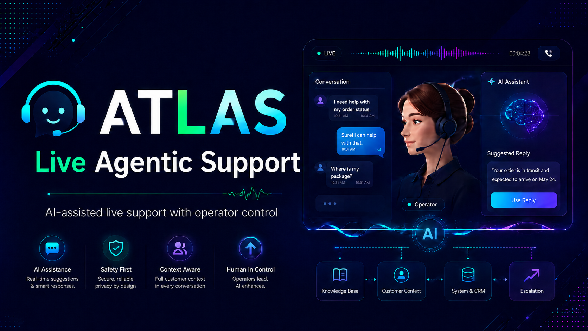

# ATLAS | Live Agentic Support



[Technical guide](README-2.md) | [Database seed](template-database-seed) | [Client template](template-client-folder) | [Public knowledge template](template-public-knowledgebase) | [Issues](https://github.com/appatalks/atlas-agent/issues)

ATLAS is a local, operator-controlled AI support agent for live customer conversations. It listens to call audio, starts with shared public knowledge, adds private knowledge only for the client selected by the operator, applies explicit global and client guardrails, and speaks through voice profiles when the operator authorizes or enables autonomous participation.

## Public Quick Install

Install ATLAS with one command:

```bash
curl -fsSL https://raw.githubusercontent.com/appatalks/atlas-agent/main/get-atlas.sh | bash
```

Then launch ATLAS:

```bash
atlas
```

The installer creates an `atlas` command and, on Linux, a desktop application entry. Use `atlas status`, `atlas stop`, and `atlas update` for everyday operation. The first installation checks required local audio, transcription, voice, and model dependencies; it reports any missing system prerequisite before changing the audio graph.

Or clone manually:

```bash
git clone https://github.com/appatalks/atlas-agent.git
cd atlas-agent
bash tools/install.sh
atlas
```

## What You Get

| | |
| --- | --- |
| **Live call bridge** | PipeWire call capture, isolated agent microphone, and local operator monitoring. |
| **AppaTalks voice** | Local voice synthesis with a prewarmed Standard Greeting. |
| **Operator control** | Monitor, approve, autonomous, mute, takeover, and live-representative escalation controls. |
| **Client isolation** | Public-only operation by default, then stable client-ID routing to separate SQLite caches or explicitly selected ADX databases, with no model-accessible database tools. |
| **Portable knowledge** | Versioned JSON snapshots move the same policies, documents, proposals, and history between SQLite and Azure Data Explorer. |
| **Shared public knowledge** | One durable, folder-backed source stays local by default and can optionally use a selected public ADX database without weakening client isolation. |
| **Autonomous improvement** | Completed sessions are evaluated for reusable learning; only resolved, low-risk, exact-evidence candidates can auto-promote, with customer feedback as a bounded quality signal. |
| **Guardrails** | Global and per-client disclosure, sensitivity, and escalation rules take precedence over reference material. |
| **Local reasoning** | Local Qwen or authenticated GitHub Copilot CLI reasoning. |

## Get Started

1. Launch `atlas` and join the call.
2. Choose Local SQLite or Azure Data Explorer in **Settings > Workspace**, then configure a durable shared public knowledge folder from [template-public-knowledgebase](template-public-knowledgebase). Leave the optional public database blank to keep that scope local.
3. Use the main **Client** window to stay in **Public knowledge only**, select an automatically discovered ADX database, or select/create a local SQLite client.
4. In SQLite mode, optionally add a folder based on [template-client-folder](template-client-folder) for additive session context and meeting artifacts, then select **Load context**.
5. Start a session. ATLAS sends the Standard Greeting once. A clear resolution phrase can trigger customer feedback and autonomous learning evaluation, or the operator can choose **Ask feedback & finish**.
6. Choose Monitor, Approve, or Autonomous mode. Use takeover whenever a person should resume the conversation. Autonomous learning and customer feedback can be disabled independently under **Settings > Agent**.

The committed templates are fictional examples. Real client data, supplementary context folders, and generated `.atlas/` databases belong outside this repository.

## Privacy

ATLAS is an operator tool, not an unattended participant. Inform participants that an AI agent is present and obtain the required consent before capturing or retaining meeting material. Client context is opt-in; public and client guardrails are loaded before scoped database recall.

## Supervision And Responsibility

ATLAS can generate inaccurate, incomplete, or inappropriate responses. A qualified human operator must actively supervise every live use, review or override agent output when needed, and take over the conversation for sensitive, high-impact, legal, financial, medical, security, or account-authority decisions. The project is provided as a tool; operators are responsible for validating outputs, protecting client data, meeting all applicable laws and policies, and obtaining any required participant consent.

## Independent Project

ATLAS is an independent, maintainer-led fun project. It is not an official product, service, or support channel of any company, platform, or model provider, and it comes without enterprise support or service-level commitments.

For manual installation, architecture, audio routing, client context, themes, troubleshooting, APIs, and validation, see [README-2.md](README-2.md).

---

## Built With Eva-Agent

ATLAS's database memory, backend portability, scoped recall, and reviewed knowledge-update patterns build on technology developed in [Eva-Agent](https://github.com/appatalks/eva-agent/).

<a href="https://github.com/appatalks/eva-agent/"></a>